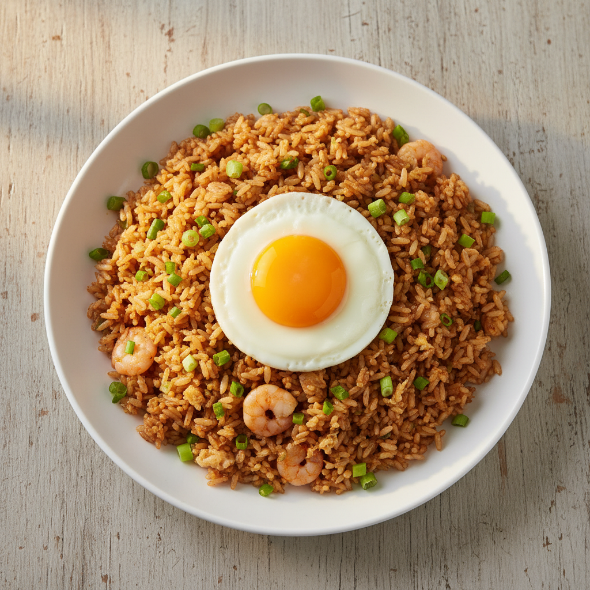

# 굴소스 볶음밥

> 조리시간: 10분 | 1인분 | 난이도: 쉬움

## 재료
- 밥 — 1공기 (200g)
- 달걀 — 1개
- 굴소스 — 1큰술
- 대파 — 1/4대 (없으면 생략 가능)
- 마늘 — 1쪽 (없으면 마늘 가루 1/4작은술)
- 식용유 — 1큰술
- 간장 — 1/2작은술
- 후추 — 약간

## 만드는 법
1. 대파는 송송 썰고, 마늘은 다져 둡니다. (냉장고에서 꺼낸 찬밥이라면 전자레인지에 1분 돌려 미리 데워 두세요.)
2. 팬에 식용유를 두르고 중불로 달군 뒤, 마늘을 넣어 30초간 볶아 향을 냅니다.
3. 달걀을 팬 한쪽에 깨 넣고 젓가락으로 재빠르게 스크램블합니다. 완전히 익기 직전에 밥을 바로 위에 올립니다.
4. 주걱으로 달걀과 밥을 함께 섞으며 강불로 올린 뒤 1~2분간 볶습니다.
5. 굴소스와 간장을 넣고 밥 전체에 고루 섞이도록 30초간 더 볶습니다.
6. 대파를 넣고 한 번 더 섞은 뒤, 후추를 뿌리고 불을 끕니다.

## 꿀팁
- 찬밥을 사용하면 밥알이 뭉치지 않고 훨씬 잘 볶아져요. 갓 지은 밥보다 훨씬 맛있습니다!
- 팬 하나로 완성되는 요리라 설거지가 거의 없어요. 밥그릇에 바로 담으면 더욱 간편합니다.
- 냉장고 속 자투리 채소(당근, 냉동 옥수수, 시금치 등)를 2단계에서 함께 볶으면 더욱 든든한 한 끼가 됩니다.
- 굴소스가 없다면 간장 1큰술 + 설탕 1/2작은술로 대체할 수 있어요.
- 더 짭조름하게 먹고 싶다면 굴소스를 1/2큰술 더 추가해 보세요.
